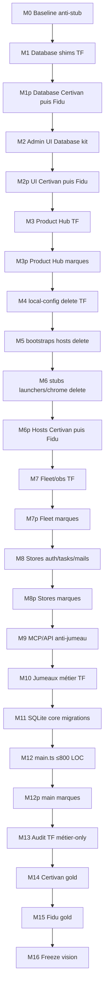

# Plan M* — Migration vision stricte (module par module)

**Principe non négociable :** une seule étape à la fois ; pas de M(n+1) tant que
gate M(n) rouge.

**Stubs / façades / jumeaux / fichiers plateforme dans TF = étape NON terminée.**

**Extraire l’existant TF → kit ; ne pas inventer.** Push GitHub kit + marque
touchée après chaque étape verte.

Gates go/no-go global (toutes les M*) :

```bash
cd /opt/docker/creezio && npm test && npm run build:packages
# sync vendor marque : TOUJOURS liste complète (jamais CREEZIO_VENDOR_PACKAGES=unSeul)
cd /opt/docker/tempoflow2/crm && bash scripts/electron/sync-creezio-vendor.sh
```

Baseline inventaire : [PHASE-M0.md](PHASE-M0.md).

---

## Ordre

`M0 → M1 → M1p → M2 → M2p → M3 → M3p → M4 → M5 → M6 → M6p → M7 → M7p → M8 → M8p → M9 → M10 → M11 → M12 → M12p → M13 → M14 → M15 → M16`

| Étape | Contenu | Done vision |
|-------|---------|-------------|
| **M0** | Baseline anti-demi-mesure | Inventaire + freeze |
| **M1** | Database : supprimer shims TF | Plus de `src/lib/database/` |
| **M1p** | Propagate Certivan/Fidu | Idem marques |
| **M2** | Admin UI Database → kit | Plus de panels TF |
| **M2p** | UI sur Certivan/Fidu | |
| **M3** | Product Hub sans façade | Plus de `plugin-control-api` jumeau |
| **M3p** | Marques | |
| **M4** | Delete `local-config` TF | Jumeau mort |
| **M5** | Delete bootstraps hermes/n8n | Hooks ≤200 LOC |
| **M6** | Delete stubs launchers/chrome | **Hosts OK** seulement ici |
| **M6p** | Hosts marques | |
| **M7–M7p** | Fleet/obs sans stubs | |
| **M8–M8p** | Stores auth/tasks/mails mince | |
| **M9** | MCP/API anti-jumeau | |
| **M10** | Un seul arbre métier TF | |
| **M11** | Migrations cœur = kit | |
| **M12** | `main.ts` ≤800 LOC | |
| **M12p–M15** | Marques gold | |
| **M16** | Freeze matrice vision | |

---

## M0 — Baseline anti-demi-mesure

Voir [PHASE-M0.md](PHASE-M0.md).

- **Done** : inventaire daté + freeze ; zéro cutover.
- **Effort S · Republish non**

---

## M1 — Database engine : cutover TF sans shims

1. **Objectif** : `@creezio/database` est le seul SoT ; TF n’a plus de dossier shim `src/lib/database/*`.
2. **Inclus** : suppression des re-exports ; imports directs `@creezio/database` ; câblage marque (`configureDatabasePolicy`) hors arbre `lib/database/`.
3. **Exclu** : UI Admin Database ; Certivan/Fidu.
4. **Tests gate** : kit `npm test` + `npm run build -w @creezio/database` ; TF `electron:compile && test:database-module`.
5. **Done** : `test ! -d crm/src/lib/database` ; `rg "from ['\"].*lib/database" crm/src` → 0 ; imports `@creezio/database` dans consumers.
6. **Effort S · Risque moyen · Republish non**

---

## M1p — Database engine : propagate Certivan + Fidu

Séquentiel Certivan puis Fidu. Même done que M1. Gate `test:database-module` (porter si absent — pas stub de test).

---

## M2 — Admin UI Database hors TF

Porter `database-client.tsx` + `database-automations-panel.tsx` → kit. Route `admin-database.ts` ≤ ~150 LOC (auth + mount + policy). Republish oui.

---

## M2p — Admin UI Database : Certivan + Fidu

Même UI kit ; zéro copie locale du panel.

---

## M3 — Product Hub / control-plane : zéro façade TF

Supprimer / amincir à zéro `plugin-control-api.ts` jumeau ; adapters verticaux uniquement.

---

## M3p — Product Hub marques

Après M3 TF.

---

## M4 — Delete `local-config` TF

Jumeau `electron/local-config.ts` → kit `@creezio/platform-core` / electron-shell uniquement.

---

## M5 — Delete bootstraps hermes/n8n

`hermes-runtime-bootstrap` / `n8n-runtime-bootstrap` → kit ; hooks marque ≤200 LOC.

---

## M6 — Delete stubs launchers/chrome

**Hosts OK** seulement quand launchers / chrome = imports kit (plus stubs).

---

## M6p — Hosts Certivan puis Fidu

---

## M7–M7p — Fleet / observability sans stubs

---

## M8–M8p — Stores auth/tasks/mails mince

---

## M9 — MCP/API anti-jumeau

Voir [PHASE-M9.md](PHASE-M9.md).

1. **Objectif** : runtime/proxy MCP + tools cœur SoT `@creezio/mcp-facade` ;
   TF/Certivan sans `mcp-runtime` / `mcp-hono-proxy` dans `electron/modules/`.
2. **Inclus** : `wrapMcpFacadeWithHonoProxy`, `MCP_PRODUCT_EXECUTOR`,
   `createCoreMcpTools` / `CREEZIO_CORE_MCP_TOOL_NAMES` ; mounts métier restent marque.
3. **Exclu** : unifier arbre métier TF (→ **M10**).
4. **Done** : jumeaux plateforme absents ; gates H4/D1/MCP/i12 verts.

---

## M10 — Un seul arbre métier TF

`electron/modules/{panier,dispatch,…}` absents si doublon `crm/modules/`.

---

## M11 — SQLite core layout / migrations cœur

---

## M12 — `main.ts` ≤ 800 LOC

---

## M12p — main marques

---

## M13 — Audit TF métier-only

---

## M14 — Certivan gold

---

## M15 — Fidu gold (+ ship pipeline)

---

## M16 — Freeze vision + matrice

---

## Flowchart



---

## Chemin critique

`M1 → M2 → M3 → M4 → M5 → M6 → M12 → M13`

Bloqueur n°1 : jumeaux hosts (`local-config`, bootstraps, stubs launchers) —
les sign-offs R3 « stub = done » sont **invalidés** par ce plan.
