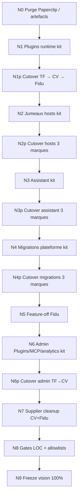

# Plan N* — Finir la vision post-M16 (~45–50 % → 100 %)

**Baseline HEAD (audit 2026-07-30)**  
kit `e4b23ec` (M16 freeze) · TF `3565524` · Certivan `e51b369` · Fidu `2cc207e`

**Règles non négociables** (héritées M0)  
Commun = `@creezio/*` uniquement · Marques = minimum métier · Stubs / façades /
jumeaux / fichiers plateforme = **NON done** · Extraire l’existant, ne pas
inventer · Tests verts → push → étape suivante · **Pas de N(n+1) si gate N(n)
rouge** · Sync vendor = **liste complète** · Cutover marques séquentiel `*p` :
TF → Certivan → Fidu (sauf N5 Fidu-only et N0 artefacts) · **Paperclip = mort**.

Phases livrées : [PHASE-N0.md](PHASE-N0.md) · [PHASE-N1.md](PHASE-N1.md) ·
[PHASE-N1p.md](PHASE-N1p.md) · [PHASE-N2.md](PHASE-N2.md) ·
[PHASE-N2p.md](PHASE-N2p.md) · suite N3→N9 ci-dessous.

---

## N0 — Purge artefacts (Paperclip build + Fidu git clean)

1. **Objectif** : zéro artefact Paperclip sur disque / WT ; Paperclip mort partout.
2. **Inclus** : purge `fidu/crm/build/electron/paperclip*` ; assert `.gitignore`
   `/build` ; assert TF/CV/Fidu sans `paperclip-*` src/build runtime.
3. **Exclu** : extraction code ; sync vendor ; republish.
4. **Tests gate** : kit `npm test` (incl. `test-phase-n0`) ; absents
   `paperclip-launcher` src/build 3 marques.
5. **Done** : [PHASE-N0.md](PHASE-N0.md).
6. **Effort S · Republish non**

---

## N1 — Runtime plugins Electron → kit ✅

1. **Objectif** : SoT spawn/discover/git/control-extras dans
   `@creezio/electron-shell`.
2. **Inclus** : extraction TF `plugin-runtime|launcher|git|control-extras` (+
   deps plateforme jumelles si pures) + `brand-bindings` / adapters / crm-key /
   accept-check / test-runner / data ; events+grants = réexport platform-core.
3. **Exclu** : UI Admin Plugins ; cutover marques (N1p).
4. **Tests gate** : `npm run build:packages && npm test` (+ `test-phase-n1`).
5. **Done** : [PHASE-N1.md](PHASE-N1.md) inventaire + LOC · baseline N0 `1aac0e2`.
6. **Effort L · Republish non**

---

## N1p — Cutover plugins runtime (TF → Certivan → Fidu) ✅

1. **Objectif** : jumeaux runtime absents ; imports `@creezio/electron-shell`.
2. **Inclus** : delete cutover ; `plugin-control-api` ≤40 LOC ou absent ; sync
   vendor liste complète.
3. **Exclu** : UI admin ; assistant ; meili-indexer.
4. **Tests gate** : par marque `sync-creezio-vendor` + `electron:compile` +
   `test:plugin-*` + `test:shell` ; kit `npm test`.
5. **Done** : [PHASE-N1p.md](PHASE-N1p.md) — TF `063ac3c` · CV `e463290` ·
   Fidu `2fd5a0f` ; baseline N1 `fadb3e4`.
6. **Effort L · Republish différé** (wiring electron, non packing)

---

## N2 — Jumeaux hosts → kit ✅

1. **Objectif** : SoT utilitaires host / ai-workspace / meili (+ embeds déjà B2)
   dans `@creezio/electron-shell` (+ canaux preload `@creezio/shell`).
2. **Inclus** : crash-reporter, web-telemetry, bridge-client, server-launcher ;
   ai-workspace (manager/actions/screencast/profile) ; meili (schema/coherence/indexer TF gold) ;
   embeds/sandbox déjà SoT platform-core / electron-shell (B2) documentés.
3. **Exclu** : cutover marques (N2p) ; seeds métier ; supplier-tabs ; assistant ; migrations.
4. **Tests gate** : `npm run build:packages && npm test` (+ `test-phase-n2`).
5. **Done** : [PHASE-N2.md](PHASE-N2.md) · baseline N1p `16b61f7`.
6. **Effort L · Republish non**

---

## N2p — Cutover hosts (TF → Certivan → Fidu) ✅

1. **Objectif** : jumeaux host plateforme absents ; imports
   `@creezio/electron-shell` / `@creezio/platform-core` ; preload mince.
2. **Inclus** : delete cutover ; `host-n2-bindings` ; host-stack kit ; preload
   `createDesktopApi`+esbuild ≤260 LOC ; Meili TF = hooks kit ; CV/Fidu =
   indexeurs métier conservés ; sync vendor liste complète.
3. **Exclu** : assistant (N3) ; seeds métier hors bindings ; packing/republish.
4. **Tests gate** : par marque `electron:compile` + hermes/n8n/shell (+
   ai-workspace) + `build` ; kit `npm test` (+ `test-phase-n2p`).
5. **Done** : [PHASE-N2p.md](PHASE-N2p.md) — TF `b602b08` · CV `7e5bfa6` ·
   Fidu `393bb98` ; baseline N2 `9f44eb6`.
6. **Effort L · Republish différé** (wiring electron, non packing)

---

## N3 — Assistant marque → `@creezio/assistant`

Extraction lib+UI générique (~11 kLOC TF) → kit.  
**Effort L · Republish non**

---

## N3p — Cutover assistant (TF → CV → Fidu)

Marques = mounts / brand hooks.  
**Effort L · Republish oui** ×3

---

## N4 — Migrations historiques plateforme → kit

Hors `platformCoreMigrations` déjà gold.  
**Effort M · Republish non**

---

## N4p — Cutover migrations (TF → CV → Fidu)

**Effort M · Republish oui** si boot DB

---

## N5 — Feature-off Fidu (`host-na-stubs` → contrat kit)

Fidu-only.  
**Effort S · Republish oui** Fidu

---

## N6 — Admin Plugins / MCP / analytics génériques → kit

**Effort M · Republish non**

---

## N6p — Cutover admin (TF → CV)

**Effort M · Republish oui**

---

## N7 — `supplier-tabs` hors métier Certivan / Fidu

Reste **métier TF** only.  
**Effort M · Republish oui** CV/Fidu

---

## N8 — Gates LOC + allowlists vision

Budgets mesurables 3 marques + forbidden lists.  
**Effort M · Republish non**

---

## N9 — Freeze vision 100 %

Matrice + PLAN-N + SHAs gold ; dry-run sync ×3.  
**Effort S · Republish non**

---

## Flowchart

---

## Engagement process

- **Pas de N(n+1) si gate N(n) rouge.**
- Push GitHub kit + marque touchée après chaque étape verte.
- Sync vendor = liste complète.
- Extraire TF (gold) ; ne pas inventer.
- Stubs / façades / jumeaux = **NON done**.
- Paperclip = mort — ne jamais réintroduire.
